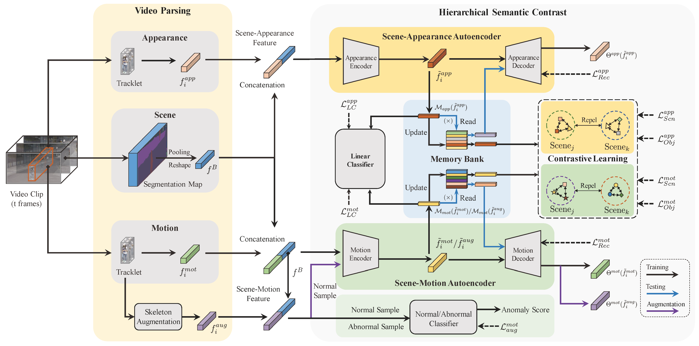

# HSC_VAD
This repo is the official Pytorch implementation of paper:
>"[**Hierarchical Semantic Contrast for Scene-aware Video Anomaly Detection**](https://arxiv.org/pdf/2303.13051.pdf)"
>

## Overview



## Requirements
Please follow the `requirements.txt`

## Video Parsing

### Objects Tracking
You can use the [FairMot](https://github.com/ifzhang/FairMOT)([MCMOT](https://github.com/CaptainEven/MCMOT)) for obtaining the boundingboxes of objects.

### Appearance Branch
We use the pre-trained ViT for extracting the appearance features of objects, you can refer to the implementations of [PyTorch-Pretrained-ViT](https://github.com/lukemelas/PyTorch-Pretrained-ViT).

### Motion Branch
We use the [PoseConv3D](https://github.com/kennymckormick/pyskl) for motion features extraction, and we use the following Python script to get the 512-dimension motion features.

```python
results, feats = inference_recognizer(model, fake_anno, outputs=['backbone'])
backbone_feats = feats['backbone']
avg_pool = torch.nn.AdaptiveAvgPool3d(1)
pool_feats = torch.mean(avg_pool(backbone_feats), dim=0).view([-1])
```                  
### Scene Branch
We use the [DeepLabV3+](https://github.com/VainF/DeepLabV3Plus-Pytorch) to generate a segmentation map, you can employ this backbone to get the scene features.
For scene features extraction with this backbone, you can modify the `utils.py` and add the following Python script.
```python
features = self.backbone(x)
x = self.classifier(features)
maxpool2d = nn.MaxPool2d(4)
feat = maxpool2d(x)
ind, feat = feat.max(1)[1], feat.max(1)[0]
feat[ind > 10] = 0 #filtering the foreground objects
feat = feat.view([-1])
feat = F.normalize(feat, p=2, dim=-1)
```
Then you can use the PCA and DBSCAN for obtaining the pseudo-labels of scene features, take the example of ShanghaiTech:
```python
from sklearn.manifold import TSNE
from sklearn.cluster import DBSCAN
dim_processor = TSNE(n_components=2, init="pca", random_state=0)
scene_features = dim_processor.fit_transform(scene_features)
label = DBSCAN(eps=4.63, min_samples=5).fit_predict(scene_features)
```

### Extracted Features
- You can download the extracted features from links below:
>[**ShanghaiTech (code:9LX7)**](https://web.ugreen.cloud/web/#/share/EC-5j4g554JJ122do8o-309B96)
>
>[**CUHK Avenue (code:6F9A)**](https://web.ugreen.cloud/web/#/share/EC-t5AG554JJ122HriL-309B96)
>
>[**UCSD Ped2 (code:65K7)**](https://web.ugreen.cloud/web/#/share/EC-9KnA554JJ122s3tm-309B96)
>
>[**Mixture datasets (code:SW85)**](https://web.ugreen.cloud/web/#/share/EC-Wtob554JJ122ePGR-309B96)
>

## Moiton Augmentation (Optional)
If you would like to utilize the motion(skeleton) augmentation, you can use the following commands, otherwise, you can skip this.
Define the rotation angles and related points.
```python
n_frames = 16 #16 frames in a clip
cutting_prob = 0.5 #the cutting probability
rotate_prob = 0.5 #the rotation probability
angle_range = [[], [], [], [], [], [-10, 10], #0-5
               [-10, 10], [-90, 90], [-90, 90], [0, 90], [0, 90], #6-10
               [-10, 10], [-10, 10], [-90, 90], [-90, 90], [-90, 0], [-90, 0]] #11-16

related_point = [[], [], [], [], [], [5, 7, 9], #0-5
                 [6, 8, 10], [7, 9], [8, 10], [9], [10], #6-10
                 [11, 13, 15], [12, 14, 16], [13, 15], [14, 16], [15], [16]] #11-16

ancestor_point = [[], [], [], [], [], 3, #0-5
                  4, 5, 6, 7, 8, #6-10
                  5, 6, 11, 12, 13, 14] #11-16
```

Define the transformation function:
```python
def rotate_point(keypoints, related_point_i, ancestor_point, angle):
    rotate_mat = np.array([[np.cos(math.radians(angle)), np.sin(math.radians(angle))],
                           [-np.sin(math.radians(angle)), np.cos(math.radians(angle))]])
    keypoints[:, :, related_point_i, :] = np.matmul(keypoints[:, :, related_point_i, :] - keypoints[:, :, ancestor_point, :], rotate_mat) + keypoints[:, :, ancestor_point, :]

def spatial_transformation(keypoints):
    for point_i in range(5, 17):
        if np.random.rand() > rotate_prob:
            angle = random.uniform(angle_range[point_i][0], angle_range[point_i][1])
            for related_point_i in related_point[point_i]:
                rotate_point(keypoints, related_point_i, ancestor_point[point_i], angle)
    return keypoints

def temporal_cutting(keypoints):
    for frame_i in range(n_frames):
        if np.random.rand() > cutting_prob:
            keypoints[0, frame_i, :, :] = 0
    return keypoints
```
Combining with PoseConv3D, you can use the following Python script:
```python
for aug_i in range(4):
    fake_anno_copy = deepcopy(anno_raw) #anno_raw is obtained by PoseConv3D
    keypoints = fake_anno_copy['keypoint']
    if aug_i == 0:
        keypoints = spatial_transformation(keypoints)
    if aug_i == 1:
        keypoints = temporal_cutting(keypoints)
    if aug_i == 2:
        keypoints = temporal_cutting(spatial_transformation(keypoints))
    if aug_i == 3:
        keypoints = spatial_transformation(temporal_cutting(keypoints)) 
```

### Motion Classifier Training

> You can train the motion binary classifier by `motion_classifier_training.py`.

For ShanghaiTech:
```shell
python motion_classifier_training.py --dataset ShanghaiTech --train_dataset_path ShanghaiTech_MA_training_dataset.npy --batch_size 512
```

For CUHK_Avenue:
```shell
python motion_classifier_training.py --dataset Avenue --train_dataset_path Avenue_MA_training_dataset.npy --batch_size 512
```
- You can download the motion augmentation training datasets from links below:
>[**ShanghaiTech (code:37JE)**](https://web.ugreen.cloud/web/#/share/EC-ARKQ554JJ122UUWB-309B96)
>
>[**CUHK Avenue (code:T5Y6)**](https://web.ugreen.cloud/web/#/share/EC-pSPZ554JJ122LGJN-309B96)
>

## Training

> Check the configurations of datasets in `config/`, e.g. `ShanghaiTech.yaml`

For ShanghaiTech:
```shell
python HSC_training.py --dataset ShanghaiTech --gpu 0
```

For CUHK_Avenue:
```shell
python HSC_training.py --dataset Avenue --gpu 0
```

For UCSD_ped2:
```shell
python HSC_training.py --dataset UCSD_ped2 --gpu 0
```

For Mixture datasets, take a example of 01+02：
```shell
python HSC_training.py --dataset Mixture0102 --gpu 0
```

## Inference

> Check the configurations of datasets in `config/`, e.g. `ShanghaiTech.yaml`

> If you would like to use the motion augmentation mode, you can set the `augmentMotion` to `true` in the yaml file.

For ShanghaiTech:
```shell
python HSC_testing.py --dataset ShanghaiTech --gpu 0
```

For Avenue:
```shell
python HSC_testing.py --dataset Avenue --gpu 0
```

For UCSD_ped2:
```shell
python HSC_testing.py --dataset UCSD_ped2 --gpu 0
```

For Mixture datasets, take a example of 01+02：
```shell
python HSC_training.py --dataset Mixture0102 --gpu 0
```

- You can download the checkpoint models from links below:
>[**ShanghaiTech (code:YF69)**](https://web.ugreen.cloud/web/#/share/EC-5vPZ554JJ122Zg0P-309B96)
>
>[**CUHK Avenue (code:H8W5)**](https://web.ugreen.cloud/web/#/share/EC-2MWG554JJ1220fwY-309B96)
>
>[**UCSD Ped2 (code:5WDC)**](https://web.ugreen.cloud/web/#/share/EC-ns6F554JJ122jhPB-309B96)
>
>[**Mixture datasets (code:S8V6)**](https://web.ugreen.cloud/web/#/share/EC-LvaA554JJ122sFgp-309B96)
>

- You can download the generated augmentation scores from links below:
>[**ShanghaiTech (code:F4W6)**](https://web.ugreen.cloud/web/#/share/EC-BhUN554JJ1229mtC-309B96)
>
>[**CUHK Avenue (code:547K)**](https://web.ugreen.cloud/web/#/share/EC-Sgmk554JJ122iRiX-309B96)
>

## Results

|     Model      | UCSD Ped2 | CUHK Avenue | ShanghaiTech |
| :------------: | :-------: | :---------: | :----------: |
|      HSC       |   98.1%   |    92.4%    |    83.0%     |
|   HSC w/ MA    |   98.1%*  |    93.7%    |    83.4%     |
> *: We only use the appearance branch in the UCSD Ped2.


## License
This repo is released under the MIT License.

## Citation

If this repo is useful for your research, please consider citing our paper:
```bibtex
@article{sun2023hierarchical,
      title={Hierarchical Semantic Contrast for Scene-aware Video Anomaly Detection}, 
      author={Shengyang Sun and Xiaojin Gong},
      year={2023},
      journal={arXiv preprint arXiv:2303.13051},
}
```


## Acknowledgements 
The video parsing backbones of this repo are based on [FairMot](https://github.com/ifzhang/FairMOT)([MCMOT](https://github.com/CaptainEven/MCMOT)), [ViT](https://github.com/lukemelas/PyTorch-Pretrained-ViT), [PoseConv3D](https://github.com/kennymckormick/pyskl) and [DeepLabV3+](https://github.com/VainF/DeepLabV3Plus-Pytorch), we sincerely thank them for their contributions.


